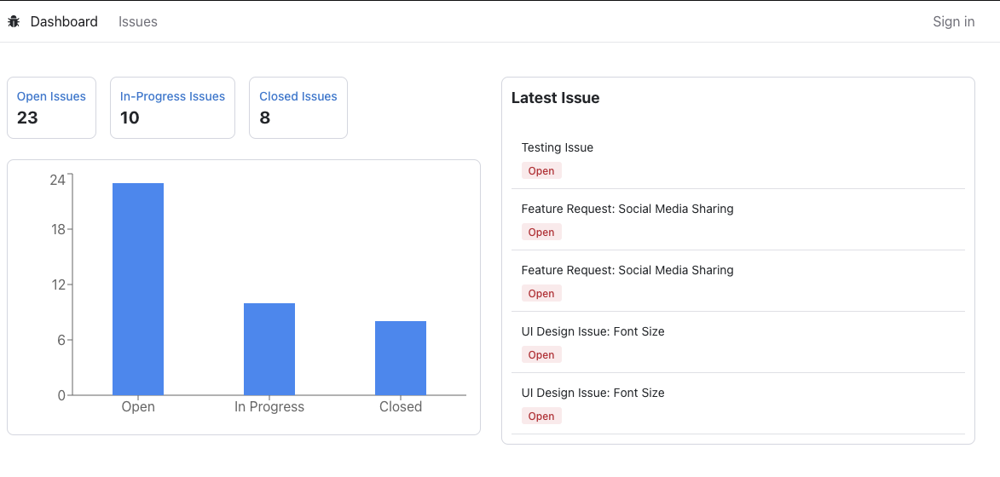
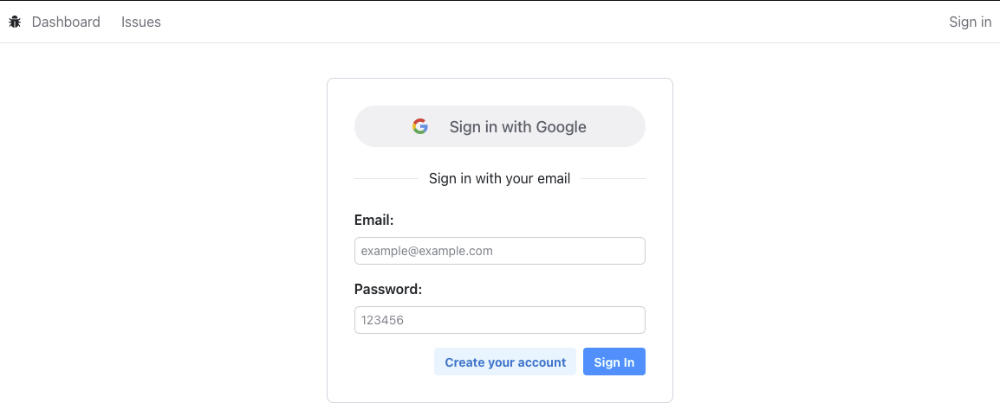
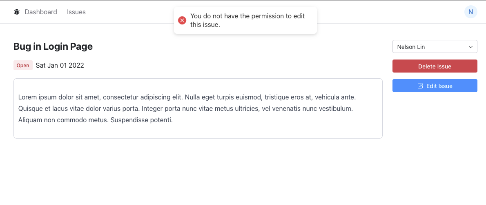
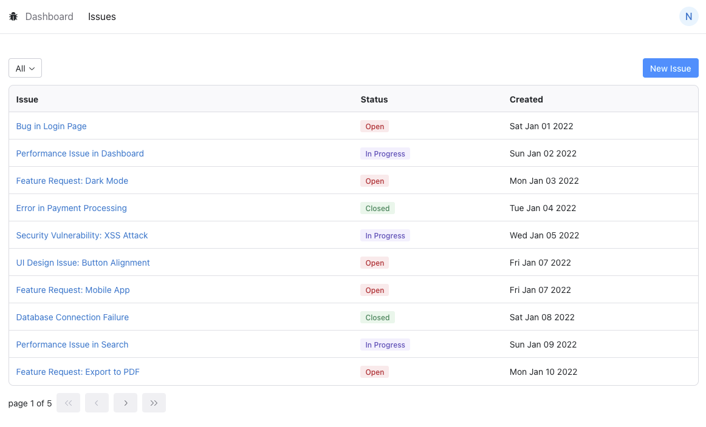
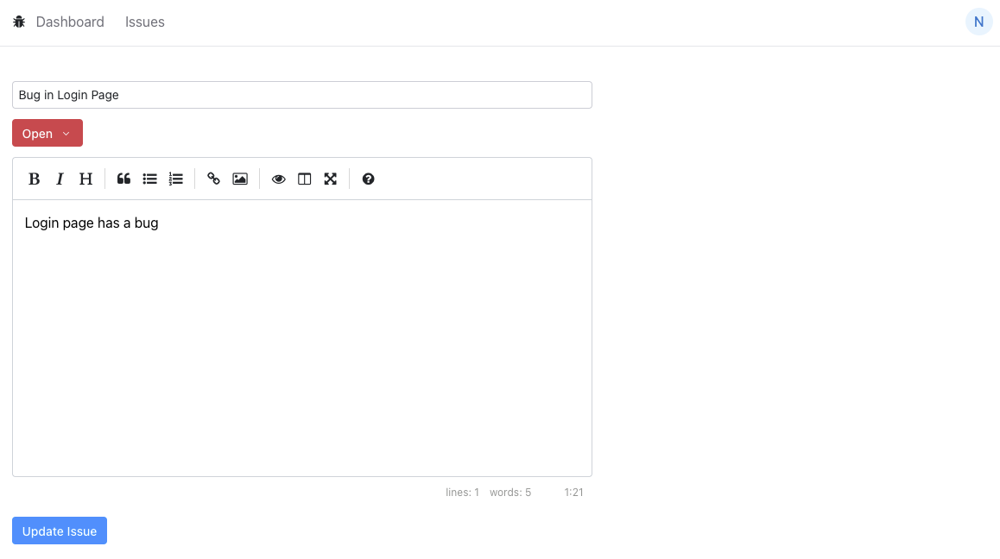

# Issue Tracker with role based access control based on Google OAuth and, email and password authentication

A full stack Next.js Web that views and manage issue ticker with role base access control based on Google OAuth and, email and password authentication.

The real web: https://next-issue-tracker-lilac.vercel.app

First, run the development server:

```bash
npm install
npm run dev
```

Open [http://localhost:3000](http://localhost:3000) with your browser to see the result.

## Dashboard Page


## User Login Page



## Issue Preview Page


## Issue List Page


## Issue List Page


